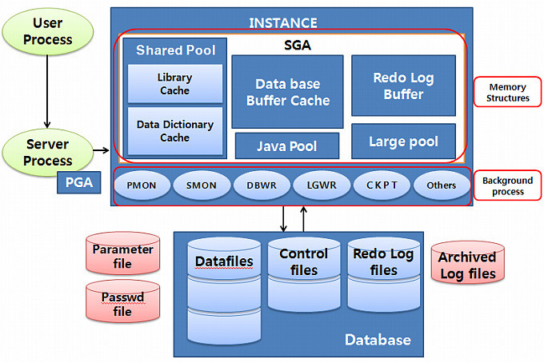

#1.2 SQL 공유 및 재사용
## 1.2.1 소프트 파싱 VS 하드 파싱
- 라이브러리 캐시(Library Cache)
  - SQL 파싱, 최적화, 로우 소스 생성 과정을 거쳐 생성한 내부 프로시저를 반복 재사용할 수 있도록 캐싱해 두는 메모리 공간
  - SGA(System Global Area)의 구성요소
    - 서버 프로세스와 백그라운드 프로세스가 공통으로 엑세스하는 데이터와 제어 구조를 캐싱하는 메모리 공간



1. 사용자가 SQL문을 전달
2. DBMS는 SQL을 파싱
3. 해당 SQL이 라이브러리 캐시에 존재하는지 확인 (**Soft Parsing 소프트 파싱**)
    - 존재하면 실행
4. 찾지 못하면 최적화 단계 및 로우 소스 생성 (**Hard Parsing 하드 파싱**)


### SQL 최적화 과정은 왜 하드(Hard)한가?
- 옵티마이저가 SQL을 최적화할 때도 데이터베이스 사용자들이 보통 생각하는 것보다 많은 일을 수행
- 예시
  - 다섯 개 테이블을 조인하는 쿼리문 하나를 최적화
  - 조인 순서만 고려해도 120(5!)가지
  - 테이블 전체를 스캔 or 인덱스 사용?
  - 인덱스 스캔에도 Index Range Scan, Index Unique Scan, Index Full Scan, Index Fast Full Scan, Index Skip Scan 다양한 방식 제공
- 대충 계산해도 수십만 가지 경우의 수가 존재
- 알고리즘과 하드웨어가 발전하면서 빠르게 처리
- 옵티마이저가 사용하는 정보
  - 테이블, 컬럼, 인덱스 구조에 관한 기본 정보
  - 오브젝트 통계 : 테이블 통계, 인덱스 통계, (히스토그램을 포함한) 컬럼 통계
  - 시스템 통계 : CPU 속도, Single Block I/O 속도, Multiblock I/O 속도 등
  - 옵티마이저 관련 파라미터
- 하나의 쿼리를 수행 
  - 후보군이 될 무수히 많은 실행경로를 도출
  - 짮은 순간에 딕셔너리와 통계정보를 읽어 각각에 대한 효율성을 판단하는 과정을 결코 가벼울 수 없음
- 데이터베이스에서 이루어지는 처리 과정은 대부분 I/O 작업에 집중되는 반면, 하드 파싱은 CPU를 많이 소비하는 몇 안 되는 작업
- 어려운 하드파싱 작업을 거쳐 생성한 내부 프로시저를 한 번만 사용하고 버린다 -> 비효율
  - 라이브러리 캐시가 필요한 이유

## 1.2.2 바인드 변수의 중요성
### 이름 없는 SQL 문제
- 이름을 가지는 경우
  - 사용자 정의 함수/프로시저, 트리거, 패키지
  - 생성할 때부터 이름을 가짐
- 이름을 가지지 않는 경우
  - SQL
  - 처음 실행할 때 최적화 과정을 거쳐 동적으로 생성한 내부 프로시저를 라이브러리 캐시에 적재함으로써 여러 사용자가 공유하면서 재사용
  - 캐시 공간이 부족하면 버려졌다가 다음에 다시 실행할 때 똑같은 최적화 과정을 거쳐 캐시에 적재

#### SQL도 사용자 정의 함수/프로시저처럼 영구 저장할 순 없을까?
- IBM DB2 -> 영구 저장
- 오라클, SQL Server -> X
- 이유
  - DBMS에서 수행되는 SQL이 모두 완성된 SQL은 아님
  - 개발 과정에는 수시로 변함
  - 일회성 SQL도 많음

### 공유가능 SQL
- 라이브러리 캐시에서 SQL을 찾기 위해 사용하는 키 값 = 'SQL문 그 자체'
- 아래는 모두 다른 SQL
```sql
SELECT * FROM emp WHERE empno = 7900;
select * from EMP where EMPNO = 7900;
select * from emp where empno = 7900;
select * from emp where empno = 7900 ;
select * from scott.emp where empno = 7900;
select /* comment */ * from emp where empno = 7900;
select /*+ first_rows */ * from emp where empno = 7900;
```
#### 예시
- 500만 고객을 보유한 어느 쇼핑몰에서 로그인 모듈 담당 개발자가 프로그램을 아래와 같이 작성
```java
public void login(String login_id) throws Exception {
    String SQLStmt = "SELECT * FROM CUSTOMER WHERE LOGIN_ID = '" + login_id +"'";
    Statement st = con.createStatement();
    ResultSet rs = st.executeQuery(SQLStmt);
    if (rs.next()) {
        // do anything
    }
    rs.close();
    st.close();
}
```
- 이 쇼핑몰에서 어느 날 12시 정각부터 딱 30분간 대대적인 할인 이벤트를 하기로 함
- 500만 명 중 20%에 해당하는 100만 고객이 이벤트 당일 12시를 전후해 동시에 시스템 접속을 시도할 경우 어떤 일이 발생할까?
  - DBMS에 발생하는 부하의 원인의 다수 -> 과도한 I/O
- 이날은 I/O가 발생하지 않음에도 불구하고 CPU사용률은 급격히 올라가고, 라이브러리 캐시에 발생하는 여러 종류의 경합 때문에 로그인이 제대로 처리되지 않을 것
- 각 고객에 대해 동시다발적으로 발생하는 SQL 하드파싱 때문
- 그 순간 라이브러리 캐시(V$SQL)를 조회해 보면, 아래와 같은 SQL로 가득 차 있음
```sql
SELECT * FROM CUSTOMER WHERE LOGIN_ID = 'oraking'
SELECT * FROM CUSTOMER WHERE LOGIN_ID = 'javaking'
SELECT * FROM CUSTOMER WHERE LOGIN_ID = 'tommy'
SELECT * FROM CUSTOMER WHERE LOGIN_ID = 'karajan'
-- ...
```
- 로그인 프로그램을 이렇게 작성 -> 고객이 로그인할 때마다 DBMS 내부 프로시저를 하나씩 만들어 라이브러리 캐시에 적재
```sql
create procedure LOGIN_ORAKING() {}
create procedure LOGIN_JAVAKING() {}
create procedure LOGIN_TOMMY() {}
create procedure LOGIN_KARAJAN() {}
-- ...
```
- 프로시저의 내부 처리 루틴은 같음
- 프로시저를 여러 개 생성할 필요가 없다.
```sql
create procedure LOGIN (login_id in varchar2){}
```
- 파라미터 Driven 방식으로 SQL을 작성하는 방법 제공됨
```java
public void login(String login_id) throws Exception {
    String SQLStmt = "SELECT * FROM CUSTOMER WHERE LOGIN_ID = ?";
    PreparedStatement st = con.prepareStatement(SQLStmt);
    st.setString(1, login_id);
    ResultSet rs = st.executeQuery();
    if (rs.next()) {
        // do anything
    }
    rs.close();
    st.close();
}
```
- 할인 이벤트가 순조롭게 진행 될 것
- 그 순간 라이브러리 캐시를 조회하면, 로그인 관련해서 아래 SQL 하나만 발견
```sql
SELECT * FROM CUSTOMER WHERE LOGIN_ID = :1
```
- SQL에 대한 하드파싱은 최초 한 번
- 캐싱된 SQL을 100만 고객이 공유하면서 재사용
