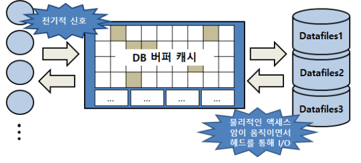
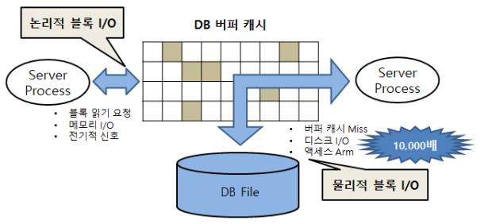
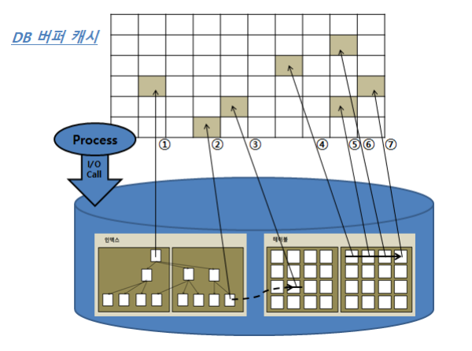
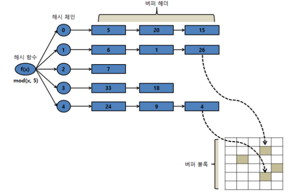

# 데이터 저장 구조 및 I/O 메커니즘
- SQL 튜닝 원리를 제대로 이해하려면 I/O에 대한 이해가 중요

## 1.3.1 SQL이 느린 이유
- I/O 때문 (디스크 I/O)
- I/O란?
  - I/O = 잠(SLEEP)
  - OS 또는 I/O 서브시스템이 I/O를 처리하는동안 프로세스는 잠을 자기 때문
    - 프로세스가 일을 하지 않고 잠을 자는 이유
      - I/O가 가장 대표적이고 절대 비중을 차지

### 프로세스
- 실행 중인 프로그램
- 생명주기를 가짐


1. 생성(new)
   - 반복
     - 준비(ready)
     - 대기(waiting)
   - 인터럽트(interrupt)
     - 수시로 실행 준비 상태(Runnable Queue)로 전환했다가 다시 실행 상태로 전환
     - interrupt 없이 열심히 일하던 프로세스도 디스크에서 데이터를 읽어야 할 때는 CPU를 OS에 반환
     - 잠시 수면(waiting) 상태에서 I/O가 완료되기를 기다린다
     - 정해진 OS 함수를 호출(I/O Call)하고 CPU를 반환한 채 알람을 설정하고 대기 큐(Wait Queue)에서 잠을 자는 것
     - 열심히 일해야할 프로세스가 잠을 자고 있음 -> I/O가 많으면 성능이 느릴 수 밖에 없음
2. 종료(terminate)

### I/O Call
- I/O Call 속도는 Single Block I/O 기준으로 평균 10ms
- 초당 100 블록쯤 읽는 셈
- SSD까지 활용하는 최근 스토리지 1 ~ 2ms, 초당 500 ~ 1000블록 읽음
- SQL이 Single Block I/O 방식으로 10,000 블록을 읽는다면?
  - 가장 최신 스토리지에서도 10초 이상 기다려야 함
- I/O 튜닝이 안 된 시스템이라면, 수많은 프로세스에 의해 동시다발적으로 발생하는 I/O Call 때문에 디스크 경합이 심해지고 그만큼 대기 시간도 늘어남
- 10초가 아니라 20초를 기다릴 수 있다는 뜻
- SQL이 느린 이유 -> 디스크 I/O
  - 디스크 I/O가 SQL 성능을 좌우함

## 1.3.2 데이터베이스 저장 구조
- 데이터를 저장하려면?
  1. 테이블스페이스 생성
    - 세그먼트를 담는 컨테이너
    - 여러 개의 데이터파일(디스크 상의 물리적인 OS 파일)로 구성

  2. 세그먼트를 생성
    - 테이블, 인덱스를 생성할 때 데이터를 어떤 테이블스페이스에 저장할지를 지정
    - 여러 익스텐트로 구성
    - 파티션 구조가 아니라면 테이블도 하나의 세그먼트, 인덱스도 하나의 세그먼트
    - 테이블 또는 인덱스가 파티션 구조 : 각 파티션이 하나의 세그먼트
    - LOB컬럼 : 자체가 하나의 세그먼트를 구성
      - 자신이 속한 테이블과 다른 별도 공간에 값을 저장
    - 익스텐트?
      - 공간을 확장하는 단위
      - 테이블이나 인덱스에 데이터를 입력하다가 공간이 부족해지면, 해당 오브젝트가 속한 테이블스페이스로부터 익스텐트를 추가로 할당 받음
      - 연속된 블록들의 집합
      - 익스텐트 단위로 공간을 확장하지만, 사용자가 입력한 레코드를 실제로 저장하는 공간은 데이터 블록
        - DB2, SQL Server : 블록 대신 페이지(page)라는 용어를 사용
      - 한 블록은 하나의 테이블이 독점
        - 한 익스텐트에 담긴 블록은 모두 같은 테이블 블록
        - MS-SQL Server : 한 익스텐트를 여러 오브젝트가 같이 사용할 수도 있음

### 테이블스페이스, 세그먼트, 익스텐트, 블록 간 관계 + 데이터파일 간의 관계
- 세그먼트 공간이 부족
  - 테이블스페이스로부터 익스텐트를 추가로 할당
  - 세그먼트에 할당된 모든 익스텐트가 같은 데이터파일에 위치하지 않을 수 있음
  - 서로 다른 데이터파일에 위치할 가능성이 더 높음
  - 하나의 테이블스페이스를 여러 데이터파일로 구성하면, 파일 경합을 줄이기 위해 DBMS가 데이터를 가능한 여러 데이터파일로 분산해서 저장하기 때문
    
- 논리적: 익스텐트 내 블록은 서로 인접한 연속된 공간
- 물리적: 익스텐트 내 블록은 연속된 공간이 아님
- 오라클 - 세그먼트에 할당된 익스텐트 목록을 조회하는 방법
```sql
SELECT SEGMENT_TYPE, TABLESPACE_NAME , EXTENT_ID , FILE_ID , BLOCK_ID , BLOCKS
FROM DBA_EXTENTS
WHERE OWNER = USER
  AND SEGMENT_NAME = 'MY_SEGMENT'
ORDER BY EXTENT_ID;
```

### 요약
- 블록 : 데이터를 읽고 쓰는 단위
- 익스텐트 : 공간을 확장하는 단위. 연속된 블록 집합
- 세그먼트 : 데이터 저장공간이 필요한 오브젝트(테이블, 인덱스, 파티션, LOB)
- 테이블스페이스 : 세그먼트를 담는 컨테이너
- 데이터 파일 : 디스크 상의 물리적인 OS 파일


## 1.3.3 블록 단위 I/O
- 데이터베이스에서 데이터를 읽고 쓰는 단위?
  - 블록 단위로 읽음
  - 오라클은 기본적으로 8KB
    - 예시) 1Byte를 읽기 위해 8KB를 읽음
- 오라클 : 블록 사이즈를 확인하는 쿼리
```sql
SELECT name, value
FROM v$parameter
WHERE name = 'db_block_size';
```

- 블록단위로 데이터를 읽고 쓰는 것은?
  - 테이블, 인덱스 포함

## 1.3.4 시퀀셜 액세스 vs 랜덤 액세스
- 테이블 또는 인덱스 블록을 읽는 두 가지 방식
### 시퀀셜 (Sequential) 엑세스
- 논리적, 물리적으로 연결된 순서에 따라 차례대로 블록을 읽는 방식
- 테이블 블록 간 논리적인 연결고리를 가지고 있지 않음
  - 어떻게 시퀸셜 방식으로 액세스하는지 
    - 오라클 기준 : 세그먼트에 할당된 익스텐트 목록을 세그먼트 헤더에 맵(map)으로 관리
    - 익스텐트 맵은 각 익스텐트의 첫 번째 블록 주소 값을 가짐
    - 읽어야 할 익스텐트 목록을 익스텐트 맵에서 얻고, 각 익스텐트의 첫 번째 블록 뒤에 연속해서 저장된 블록을 순서대로 읽으면, 그것이 곧 Full Table Scan에 해당
### 랜덤 액세스(Random)
- 논리적 물리적인 순서를 따르지 않고, 레코드 하나를 읽기 위해 한 블록씩 접근(=touch) 하는 방식

## 1.3.5 논리적 I/O vs 물리적 I/O
### DB 버퍼캐시
- 디스크 I/O가 SQL 성능을 결정
- DBMS 데이터 캐싱 메커니즘이 필수인 이유
- 라이브러리 캐시(Library Cache)
  - SQL, 실행계획, DB 저장형 함수 / 프로시저 등을 캐싱하는 '코드 캐시'
- DB 버퍼 캐시(DB Buffer Cache)
  - '데이터 캐시'
  - 디스크에서 읽은 데이터 블록을 캐싱해 둠으로써 같은 블록에 대한 반복적인 I/O Call을 줄이는 데 목적이 있음

  - 그림 처럼 서버 프로세스와 데이터 파일 사이에 버퍼캐시가 있으므로 데이터 블록을 읽을 때는 항상 버퍼캐시부터 탐색
  - 캐시블록에서 찾는 다면 -> 프로세스가 잠(I/O Call)을 자지 않아도 됨
  - 같은 블록을 읽는다면?
    - 잠을 자지 않아도 된다
- 오라클 SQL*Plus에서 버퍼캐시 사이즈를 확인하는 쉬운 방법
```sql
SELECT
    component,
    current_size / (1024 * 1024) AS size_in_mb
FROM
    V$SGA_DYNAMIC_COMPONENTS
WHERE
    component = 'DEFAULT buffer cache';
```
- DEFAULT buffer cache 구성 요소의 현재 크기를 메가바이트(MB) 단위로 반환
- V$SGA_DYNAMIC_COMPONENTS 뷰에는 다양한 SGA 구성 요소에 대한 정보가 포함되어 있으므로, component 컬럼에서 'DEFAULT buffer cache'를 필터링하여 버퍼 캐시의 크기를 확인할 수 있음

### 논리적 I/O vs 물리적 I/O
- 논리적 블록 I/O
  - SQL문을 처리하는 과정에 메모리 버퍼캐시에서 발생한 총 블록 I/O
  - SQL을 수행하면서 읽은 총 블록 I/O
  - 논리적 I/O 횟수는 DB 버퍼캐시에서 블록을 읽은 횟수왕 ㅣㄹ치
  - 논리적 I/O != 메모리 I/O 이나 결과적으로 수치는 같음
- 물리적 블록 I/O
  - 디스크에서 발생한 총 블록 I/O
  - SQL처리 도중 읽어야 할 블록을 버퍼캐시에 찾지 못할 때만 디스크를 엑세스
  - SQL 처리 도중 읽어야 할 블록을 버퍼캐시에서 찾지 못할 때만 디스크를 엑세스하므로 논리적 블록 I/O 중 일부를 물리적으로 I/O 한다
  - 데이터 입력이나 삭제가 없어도 물리적 I/O는 SQL을 실행할 때마다 다름
  - 첫 번째 실행 -> 두 번째 실행 -> 세 번째 실행 
    - 점점 줄어듬
    - 연속해서 실행하면 DB 버퍼캐시에서 해당 테이블 블록의 점유율이 점점 높아지기 때문

- 메모리 I/O는 전기적 신호인 데 반해, 디스크 I/O는 엑세스 암(Arm)을 통해 물리적 작용이 일어나므로 메모리 I/O에 비해 상당히 느림
  - 보통 10,000배쯤 느림
  - 디스크 경합이 심할 때는 더 느림


### 버퍼캐시 히트율
- Buffer Cache Hit Ratio, 'BCHR'
- 구하는 공식
```text
- BCHR = (캐시에서 곧바로 찾은 블록 수 / 총 읽은 블록 수) * 100
-      = ( (논리적 I/O - 물리적 I/O) / 논리적 I/O ) * 100
-      = ( 1 - (물리적 I/O) / (논리적 I/O) ) * 100
```
- BCHR은 읽은 전체 블록 중에서 물리적인 디스크 I/O르르 수반하지 않고 곧바로 메모리에서 찾은 비율을 나타냄
- 애플리케이션 특성에 따라 다름
  - 온라인 트랜잭션을 주로 처리하는 애플리케이션이라면 시스템 레벨에서 평균 99% 히트율을 달성해야 함

- 실제 SQL 성능을 향상하려면 물리적 I/O가 아닌 논리적 I/O를 줄여야 함
- 물리적 I/O = 논리적 I/O * (100 - BCHR)
- 논리적 I/O는 일정하므로 물리적 I/O는 BCHR에 의해 결정
- BCHR은 시스템 상황에 따라 달라지므로 물리적 I/O는 결국 시스템 상황에 의해 결정되는 통제 불가능한 외생변수
- SQL의 성능을 높이기 위해서 할 수 있는 일은 논리적 I/O를 줄이는 일
  - 예)
    - 시스템 레벨 BCHR이 평균 70%, 특정 SQL의 논리적 I/O가 10,000개면 물리적 I/O는 대략 3000개쯤 발생할 것으로 예상
    - 물리적 I/O = 논리적 I/O * (100 - 70)% = 10,000 * 30% = 3000
    - 논리적 I/O를 1,000개로 줄이면 물리적 I/O도 300으로 감소하고, 성능도 열 배 향상된다.
    - 물리적 I/O = 1000 * 30% = 300

### 논리적 I/O는 어떻게 줄일 수 있을까?
- SQL을 튜닝해서 읽는 총 블록 개수를 줄이면 된다.
- 논리적 I/O는 항상 일정하게 발생하지만, SQL 튜닝을 통해 줄일 수 있는 통제 가능한 내생변수

## 1.3.6 Single Block I/O vs MultiBlock I/O
- 메모리 캐시가 클수록 좋지만, 데이터 모두 캐시에 적재할 수 없음
- 캐시에서 찾지 못한 블록 -> I/O Call (디스크 -> DB 버퍼 캐시로 적재하고 읽음)
- I/O Call 할 때, 한 번에 한 블록씩 요청하기도 하고, 여러 블록씩 요청하기도 함

### Single Block I/O
- 한 번에 한 블록씩 요청해서 메모리에 적재하는 방식
  1. 인덱스 루트 블록을 읽을 때
  2. 인덱스 루트 블록에서 얻은 주소 정보로 브랜치 블록을 읽을 때
  3. 인덱스 브랜치 블록에서 얻은 주소 정보로 리프 블록을 읽을 때
  4. 인덱스 리프 블록에서 얻은 주소 정보로 테이블 블록을 읽을 때


### MultiBlock I/O
- 한 번에 여러 블록씩 요청해서 메모리에 적재하는 방식
- 많은 데이터 블록을 읽을 떄
- 인덱스를 이용하지 않고 테이블 전체를 스캔할 때 이 방식을 사용
- 테이블이 클수록 MultiBlock I/O 단위도 크면 좋음
  - 프로세스가 잠자는 횟수를 줄여줌
- 대용량 테이블이면 수많은 블록을 디스크에서 읽는 동안 여러 차례 잠을 잠
- 기왕에 잠을 자려면 한꺼번에 많은 양을 요청 -> 성능 향상
- 대용량 테이블을 Full Scan 할 때 MultiBlock I/O 단위를 크게 설정하면 성능이 좋아지는 이유

#### MultiBlock 요약
- 캐시에서 찾지 못한 특정 블록을 읽으려고 I/O Call할 때 디스크 상에 그 블록과 '인접한' 블록을 한꺼번에 읽어 캐시에 미리 적재하는 기능
- DBMS 블록 사이즈가 얼마건 간에 OS 단에서는 보통 1MB 단위로 I/O를 수행(OS마다 다름)

- 일반적으로 OS 레벨 I/O 단위가 1MB
- 오라클 레벨 I/O 단위가 8KB
- db_file_multiblock_read_count 파라미터를 128로 설정하면?
- 담을 수 있는 만큼 최대한 담게 됨 (8KB * 128 = 1MB)
- **인접한 블록**
  - 같은 익스텐트에 속한 블록을 의미
  - MultiBlock I/O방식으로 읽더라도 익스텐트 경계를 넘지 못한다는 뜻
  - 예)
    - 익스텐트에 20개 블록이 담겨있고, MultiBlock I/O 단위가 8이라고 할 때, 세 번째 I/O Call에서는 네 개의 블록만 얻게 됨
    - 네 개를 더 읽기 위해 다음 익스텐트까지 읽지 않는다.

## 1.3.7 Table Full Scan vs Index Range Scan

- 테이블에 저장된 데이터를 읽는 방식 2가지
1. Table Full Scan
  - 테이블 전체를 스캔해서 읽는 방식
  - 테이블에 속한 블록 '전체'를 읽어서 사용자가 원하는 데이터를 찾는 방식
2. Index Range Scan
  - 인덱스를 이용해서 읽는 방식
  - 인덱스에서 "일정량"을 스캔하면서 얻는 ROWID로 테이블 레코드를 찾아가는 방식
  - ROWID : 테이블 레코드가 디스크 상에 어디 저장됐는지를 가리키는 위치 정보
    - postgre -> 페이지

### 인덱스를 활용했는데 느린 경우
- Table Full Scan -> 시퀀셜 액세스 + MultiBlock I/O 방식으로 디스크에서 블록을 읽음
  - 한 블록에 속한 모든 레코드를 한 번에 읽어 들이고, 캐시에서 못 찾으면 '한번의 수면(I/O Call)'을 통해 인접한 수십 ~ 수백 개 블록을 한꺼번에 I/O하는 메커니즘
  - 이 방식을 사용하는 SQL은 스토리지 스캔 성능이 좋아지는 만큼 성능도 좋아짐
  - 그러나, 수십 ~ 수백 건의 소량 데이터 찾을 때는 수백만 ~ 수천만 데이터를 스캔하는 건 비효율
- Index Range Scan
  - 랜덤 액세스 + Single Block I/O 방식으로 디스크 블록을 읽음
  - 캐시에서 블록을 못 찾으면, '레코드 하나를 읽기 위해 매번 잠을 자는 I/O 메커니즘'
  - 많은 데이터를 읽을 때는 Table Full Scan 보다 불리
  - 읽었던 블록을 반복해서 읽는 비효율
    - 많은 데이터를 읽을 때 물리적인 블록 I/O 뿐만 아니라 논리적인 블록 I/O 측면에서도 불리

## 1.3.8 캐시 탐색 메커니즘
- Direct Path I/O를 제외한 모든 블록 I/O는 ㅔㅁ모리 버퍼캐시를 경우함
1. 인덱스 루트 블록을 읽을 때
2. 인덱스 루트 블록에서 얻은 주소로 브랜치 블록을 읽을 때
3. 인덱스 브랜치 블록에서 얻은 주소 정보로 리프 블록을 읽을 때
4. 인덱스 리프 블록에서 얻은 주소 정보로 테이블 블록을 읽을 때
5. 테이블 블록을 Full Scan 할 때

- DBMS는 버퍼캐시글 위의 그림과 같은 해시 구조로 관리
- 버퍼 캐시에서 블록을 찾을 때, 해시 알고리즘으로 버퍼 헤더를 찾음
- 거기서 얻은 포인터로 버퍼 블록을 액세스 하는 방식을 사용
- 해시 구조의 특징
  - 같은 입력 값은 항상 동일한 해시 체인(버킷)에 연결됨
  - 다른 입력 값이 동일한 해시 체인(버킷)에 연결될 수 있음
  - 해시 체인 내에서는 정렬이 보장되지 않음

### 메모리 공유자원에 대한 액세스 직렬화
- 버퍼캐시는 SGA 구성요소
- 버퍼캐시에 캐싱된 버퍼블록은 모두 공유자원
- 공유자원 : 모두에게 권한이 있기 때문에 누구나 접근 가능

#### 문제
- 하나의 블록을 두 개 이상 프로세스가 '동시에' 접근하려고 할 때 발생
- 동시에 접근하면 블록 정합성에 문제가 생길 수 있기 때문
- 자원을 공유하는 것처럼 보여도 내부에서는 한 프로세스씩 순차적으로 접근하도록 구현해야 함
- 직렬화 메커니즘이 필요

### 공유캐시
- 특정 자원을 두 개 이상 프로세스가 같이 사용할 수 없다.
- 특정 순간에는 한 프로세스만 사용할 수 있음
- 그 순간 다른 프로세스는 줄 서서 기다려야 함
- 그 메커니즘이 래치(Latch)
- SGA를 구성하는 서브 캐시마다 별도의 래치가 존재
- 버퍼캐시
  - 캐시버퍼 체인 래치
  - 캐시버퍼 LRU 체인 래치 등이 작동
- 빠른 데이터베이스를 구현하려면 버퍼캐시 히트율을 높여야 하지만, 캐시 I/O도 생각만큼 빠르지 않을 수 있음
  - 래치에 의한 경합이 생길 수 있기 때문
- 캐시버퍼 체인, 버퍼블록 자체에도 직렬화 메커니즘 존재
  - 버퍼블록 : LOCK
- 직렬화 메커니즘에 의한 캐시 경함을 줄이려면, SQL 튜닝을 통해 쿼리 일량(논리적 I/O) 자체를 줄여야 함

#### 캐시버퍼 체인 래치
- 대량의 데이터를 읽을 때 모든 블록에 대해 해시 체인을 탐색
- DBA(Data Block Address)를 해시 함수에 입력
- 반환된 값으로 스캔해야 할 해시 체인을 찾음
- 해시 체인을 스캔하는 동안 다른 프로세스가 체인 구조를 변경하는 일이 생기면 안 됨
- 이를 막기 위해 해시 체인 래치가 존재
- 체인 앞쪽에 자물쇠가 있는 것과 동일
- 좌물쇠를 열 수 있는 키(Key)를 획득한 프로세스만이 체인으로 진입할 수 있음

#### 버퍼 LOCK
- 읽고자 하는 블록을 찾았으면 캐시버퍼 체인 래치를 곧바로 해제해야 함
- 그래야 해당 래치가 풀리기를 기다리던 다른 프로세스들이 작업을 재개할 수 있음
- But, 래치를 해제한 상태로 버퍼블록 데이터를 읽고 쓰는 도중에 후행 프로세스가 하필 같은 블록에 접근해서 데이터를 읽고 쓴다면 데이터 정합성에 문제가 생길 수 있음
- 이를 방지하기 위해 오라클은 버퍼 LOCK을 사용
- 캐시버퍼 체인 래치를 해제학기 전에 버퍼 헤더에 Lock을 설정함으로써 버퍼블록 자체에 대한 직렬화 문제를 해결하는 것
- (같은 로우는 로우 Lock에 의해 보호될 텐데 버퍼 Lock이 왜 필요한가 싶겠지만, 로우 Lock을 설정하는 행위도 블록을 변경하는 작업이다. 로우 Lock을 설정하는 순간 다른 프로세스가 해당 블록을 읽는다면 문제가 생긴다. 그뿐만 아니라 같은 블록에서 서로 다른 로우를 동시에 읽고 쓰는 경우를 막기 위해서도 버퍼 Lock은 필요하다)
