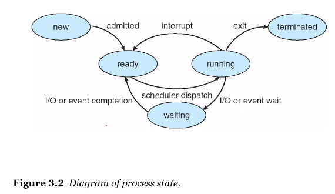
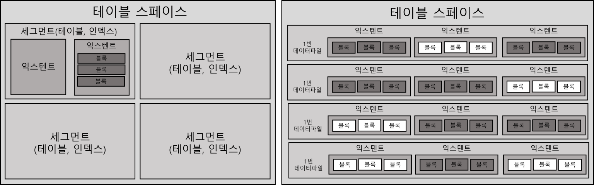
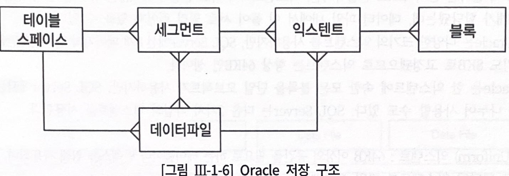
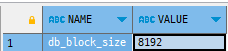

# 데이터 저장 구조 및 I/O 메커니즘
- SQL 튜닝 원리를 제대로 이해하려면 I/O에 대한 이해가 중요

## 1.3.1 SQL이 느린 이유
- I/O 때문 (디스크 I/O)
- I/O란?
  - I/O = 잠(SLEEP)
  - OS 또는 I/O 서브시스템이 I/O를 처리하는동안 프로세스는 잠을 자기 때문
    - 프로세스가 일을 하지 않고 잠을 자는 이유
      - I/O가 가장 대표적이고 절대 비중을 차지

### 프로세스
- 실행 중인 프로그램
- 생명주기를 가짐



1. 생성(new)
   - 반복
     - 준비(ready)
     - 대기(waiting)
   - 인터럽트(interrupt)
     - 수시로 실행 준비 상태(Runnable Queue)로 전환했다가 다시 실행 상태로 전환
     - interrupt 없이 열심히 일하던 프로세스도 디스크에서 데이터를 읽어야 할 때는 CPU를 OS에 반환
     - 잠시 수면(waiting) 상태에서 I/O가 완료되기를 기다린다
     - 정해진 OS 함수를 호출(I/O Call)하고 CPU를 반환한 채 알람을 설정하고 대기 큐(Wait Queue)에서 잠을 자는 것
     - 열심히 일해야할 프로세스가 잠을 자고 있음 -> I/O가 많으면 성능이 느릴 수 밖에 없음
2. 종료(terminate)

### I/O Call
- I/O Call 속도는 Single Block I/O 기준으로 평균 10ms
- 초당 100 블록쯤 읽는 셈
- SSD까지 활용하는 최근 스토리지 1 ~ 2ms, 초당 500 ~ 1000블록 읽음
- SQL이 Single Block I/O 방식으로 10,000 블록을 읽는다면?
  - 가장 최신 스토리지에서도 10초 이상 기다려야 함
- I/O 튜닝이 안 된 시스템이라면, 수많은 프로세스에 의해 동시다발적으로 발생하는 I/O Call 때문에 디스크 경합이 심해지고 그만큼 대기 시간도 늘어남
- 10초가 아니라 20초를 기다릴 수 있다는 뜻
- SQL이 느린 이유 -> 디스크 I/O
  - 디스크 I/O가 SQL 성능을 좌우함

## 1.3.2 데이터베이스 저장 구조
- 데이터를 저장하려면?
  1. 테이블스페이스 생성
    - 세그먼트를 담는 컨테이너
    - 여러 개의 데이터파일(디스크 상의 물리적인 OS 파일)로 구성

  2. 세그먼트를 생성
    - 테이블, 인덱스를 생성할 때 데이터를 어떤 테이블스페이스에 저장할지를 지정
    - 여러 익스텐트로 구성
    - 파티션 구조가 아니라면 테이블도 하나의 세그먼트, 인덱스도 하나의 세그먼트
    - 테이블 또는 인덱스가 파티션 구조 : 각 파티션이 하나의 세그먼트
    - LOB컬럼 : 자체가 하나의 세그먼트를 구성
      - 자신이 속한 테이블과 다른 별도 공간에 값을 저장
    - 익스텐트?
      - 공간을 확장하는 단위
      - 테이블이나 인덱스에 데이터를 입력하다가 공간이 부족해지면, 해당 오브젝트가 속한 테이블스페이스로부터 익스텐트를 추가로 할당 받음
      - 연속된 블록들의 집합
      - 익스텐트 단위로 공간을 확장하지만, 사용자가 입력한 레코드를 실제로 저장하는 공간은 데이터 블록
        - DB2, SQL Server : 블록 대신 페이지(page)라는 용어를 사용
      - 한 블록은 하나의 테이블이 독점
        - 한 익스텐트에 담긴 블록은 모두 같은 테이블 블록
        - MS-SQL Server : 한 익스텐트를 여러 오브젝트가 같이 사용할 수도 있음

### 테이블스페이스, 세그먼트, 익스텐트, 블록 간 관계 + 데이터파일 간의 관계
- 세그먼트 공간이 부족
  - 테이블스페이스로부터 익스텐트를 추가로 할당
  - 세그먼트에 할당된 모든 익스텐트가 같은 데이터파일에 위치하지 않을 수 있음
  - 서로 다른 데이터파일에 위치할 가능성이 더 높음
  - 하나의 테이블스페이스를 여러 데이터파일로 구성하면, 파일 경합을 줄이기 위해 DBMS가 데이터를 가능한 여러 데이터파일로 분산해서 저장하기 때문
    
- 논리적: 익스텐트 내 블록은 서로 인접한 연속된 공간
- 물리적: 익스텐트 내 블록은 연속된 공간이 아님
- 오라클 - 세그먼트에 할당된 익스텐트 목록을 조회하는 방법
```sql
SELECT SEGMENT_TYPE, TABLESPACE_NAME , EXTENT_ID , FILE_ID , BLOCK_ID , BLOCKS
FROM DBA_EXTENTS
WHERE OWNER = USER
  AND SEGMENT_NAME = 'MY_SEGMENT'
ORDER BY EXTENT_ID;
```

### 요약
- 블록 : 데이터를 읽고 쓰는 단위
- 익스텐트 : 공간을 확장하는 단위. 연속된 블록 집합
- 세그먼트 : 데이터 저장공간이 필요한 오브젝트(테이블, 인덱스, 파티션, LOB)
- 테이블스페이스 : 세그먼트를 담는 컨테이너
- 데이터 파일 : 디스크 상의 물리적인 OS 파일


## 1.3.3 블록 단위 I/O
- 데이터베이스에서 데이터를 읽고 쓰는 단위?
  - 블록 단위로 읽음
  - 오라클은 기본적으로 8KB
    - 예시) 1Byte를 읽기 위해 8KB를 읽음
- 오라클 : 블록 사이즈를 확인하는 쿼리
```sql
SELECT name, value
FROM v$parameter
WHERE name = 'db_block_size';
```

- 블록단위로 데이터를 읽고 쓰는 것은?
  - 테이블, 인덱스 포함

## 1.3.4 시퀀셜 액세스 vs 랜덤 액세스
- 테이블 또는 인덱스 블록을 읽는 두 가지 방식
### 시퀀셜 (Sequential) 엑세스
- 논리적, 물리적으로 연결된 순서에 따라 차례대로 블록을 읽는 방식
- 테이블 블록 간 논리적인 연결고리를 가지고 있지 않음
  - 어떻게 시퀸셜 방식으로 액세스하는지 
    - 오라클 기준 : 세그먼트에 할당된 익스텐트 목록을 세그먼트 헤더에 맵(map)으로 관리
    - 익스텐트 맵은 각 익스텐트의 첫 번째 블록 주소 값을 가짐
    - 읽어야 할 익스텐트 목록을 익스텐트 맵에서 얻고, 각 익스텐트의 첫 번째 블록 뒤에 연속해서 저장된 블록을 순서대로 읽으면, 그것이 곧 Full Table Scan에 해당
### 랜덤 액세스(Random)
- 논리적 물리적인 순서를 따르지 않고, 레코드 하나를 읽기 위해 한 블록씩 접근(=touch) 하는 방식
