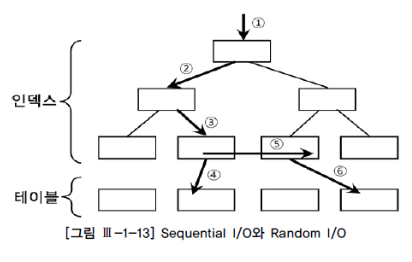
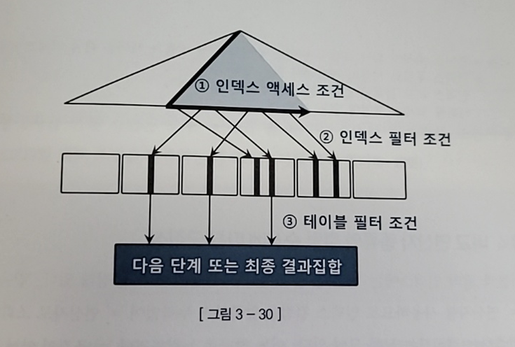
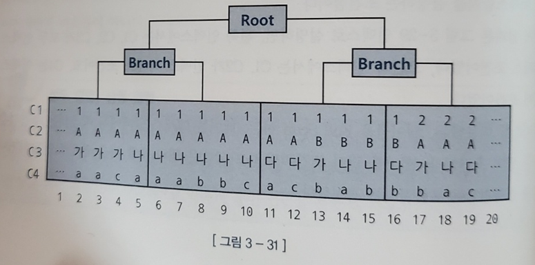
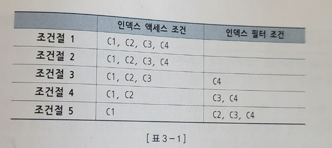

# 인덱스 스캔 효율화
- 운영 환경에서 가능한 일반적인 튜닝 기법은 인덱스 컬럼 추가

## 3.3.1 인덱스 탐색


- 수직적 탐색
- 수평적 탐색

## 3.3.2 인덱스 스캔 효율성
- 인덱스를 탄다고 무조건 좋은 경우는 없음
- 선두컬럼에 인덱스를 두고 많은 데이터가 스캔되었다면 의미가 없다
- 오히려 비효율

## 3.3.3 액세스 조건과 필터 조건

- 인덱스를 스캔하는 단계에 처리하는 조건절은 액세스 조건과 필터 조건으로 나뉜다
- 인덱스 액세스 조건
  - 인덱스 스캔 범위를 결정
- 인덱스 필터 조건
  - 테이블로 액세스할지를 결정하는 조건

### 옵티마이저 비용 계산 원리
- 비용 = 인덱스 수직적 탐색 비용 + 인덱스 수평적 탐색 비용 + 테이블 랜덤 액세스 비용
- = 인덱스 루트와 브랜치 레벨에서 읽는 블록 수 + 
- 인덱스 리프 블록을 스캔하는 과정에 읽는 블록 수 + 
- 테이블 액세스 과정에 읽는 블록 수


## 3.3.4 비교 연산자 종류와 컬럼 순서에 따른 군집성
- 테이블과 달리 인덱스에는 '같은 값'을 갖는 레코드들이 서로 군집해 있음
- 인덱스 컬럼을 앞쪽부터 누락없이 '=' 연산자로 조회하면 조건절을 만족하는 레코드들이 모두 모여있게 됨
- 이 때 어느 하나를 누락하거나 '='이 아닌 연산자로 조회하면 조건절을 만족하는 레코드가 서로 흩어진 상태가 되게 된다

- ex1) WHERE C1 = 1 and C2 = 'A' and C3 = '나' and C4 = 'a'
  - 레코드들이 5 ~ 7까지 모여있다
- ex2) WHERE C1 = 1 and C2 = 'A' and C3 = '나' and C4 >= 'a'
  - 선행 컬럼이 모두 '=' 조건이고 맨 마지막 컬럼만 범위검색 조건(부등호, BETWEEN, LIKE)일 때도 조건을 만족하는 레코드가 모여있다(5 ~ 10)
- ex3, ex4, ex5)
  - WHERE C1 = 1 and C2 = 'A' and C3 = between '가' and '다' and C4 = 'a'
  - WHERE C1 = 1 and C2 <= 'B' and C3 = '나' and C4 between 'a' and 'b'
  - WHERE C1 between 1 and 3 and C2 = 'A' and C3 = '나' and C4 = 'a'
  - 선행 컬럼이 모두 '=' 조건인 상태에서 첫번째 나타나는 범위검색 조건까지만 만족하는 인덱스 레코드는 모두 연속해서 모여있다
  - 하지만 그 이하 조건까지 만족하는 레코드는 비교 연산자 종류 상관 없이 흩어진다
  - -> 물론 범위를 줄여주긴 하겠지만 무시할 정도이다


## 3.3.5 인덱스 선행 컬럼이 등치(=) 조건이 아닐 때 생기는 비효율
- 인덱스 스캔 효율성은 인덱스 컬럼을 조건절에 모두 등치(=) 조건으로 사용할 때 가장 좋음
- 인덱스 컬럼 중 일부가 조건절에 없거나 등치 조건이 아니더라도, 그것이 뒤쪽 컬럼일 때는 비효율이 없음
- 인덱스를 [아파트시세코드 + 평형 + 평형타입 + 인터넷매물] 순으로 구성
```sql
where 아파트시세코드 = :a
where 아파트시세코드 = :a and 평형 = :b
where 아파트시세코드 = :a and 평형 = :b and 평형타입 :c
where 아파트시세코드 = :a and 평형 = :b and 평형타입 between :c and :d
```
- 반면, 인덱스 선행 컬럼이 조건절에 없거나 부등호, BETWEEN, LIKE 같은 범위검색 조건이면, 인덱스를 스캔하는 단계에서 비효율이 생김
- 인덱스가 [해당층, 평당가, 입력일, 해당동, 매물구분, 연사용일수, 중개업소코드] 라고 가정
```sql
select 해당층, 평당가, 입력일, 해당동, 매물구분, 연사용일수, 중개업소코드
from 매물아파트매매
where 아파트시세코드 = 'A01011350900056'
and 평형 = '59'
and 평형타입 = 'A'
and 인터넷매물 between '1' and '3'
order by 입력일 desc;
```
- 인터넷 매물이 Between 조건이지만 선행 컬럼들(아파트시세코드, 평형, 평형타입)이 모두 '='조건
- 인덱스 선행 컬럼이 모두 '=' 조건일 때 필요한 범위만 스캔하고 멈출 수 있는 것은, 조건을 만족하는 레코드가 모두 한데 모여 있기 때문

- 인덱스 구성 [인터넷매물 + 아파트시세코드 + 평형 + 평형타입] 순으로 바꾸면?
  - 인덱스 스캔 범위가 넓어짐

## 3.3.6 BETWEEN을 IN-LIST로 전환
- 범위검색 컬럼이 맨 뒤로 가도록 인덱스를 [아파트시세코드 + 평형 + 인터넷매물] 순으로 변경하면 좋겠지만 운영 시스템에서는 인덱스 구성을 바꾸기는 쉽지 않음
- 이럴때 BETWEEN 조건을 IN-LIST로 바꿔주면 큰 효과를 얻는 경우가 있음
```sql
select 해당층, 평당가, 입력일, 해당동, 매물구분, 연사용일수, 중개업소코드
from 매물아파트매매
where 인터넷매물 in ('1', '2', '3')
and 아파트시세코드 = 'A0101135900056'
and 평형 = '59'
and 평형타입 = 'A'
order by 입력일 desc;
```
- 예시에서는 수직적 탐색이 3번 이루어짐
- 인덱스를 세 번 탐색한다는 것은 SQL을 아래와 같이 작성한 것과 가틈
- 모든 컬럼이 '=' 조건인 것에 주목
```sql
select 해당층, 평단가, 입력일, 해당동, 매물구분, 연사용일수, 중개업소코드
from 매물아파트매매
where 인터넷매물 = '1'
and 아파트시세코드 = 'A01011350900056'
and 평형 = '59'
and 평형타입 = 'A'
union all 
select 해당층, 평당가, 입력일, 해당동, 매물구분, 연사용일수, 중개업소코드
from 매물아파트매매
where 인터넷매물 = '2'
and 아파트시세코드 = 'A01011350900056'
and 평형 = '59'
and 평형타입 = 'A'
union all
select 해당층, 평당가, 입력일, 해당동, 매물구분, 연사용일수, 중개업소코드
from 매물아파트매매
where 인터넷매물 = '3'
and 아파트시세코드 = 'A01011350900056'
and 평형 = '59'
and 평형타입 = 'A'
order by 인력일 desc;
```
- IN-LIST 개수만큼 UNION ALL 브랜치가 생성되고 각 브랜치마다 모든 컬럼을 '=' 조건으로 검색
- 선두 컬럼에 BETWEEN을 사용할 때와 가은 비효율이 사라짐

### IN-LIST가 무조건 좋은가?
- 그렇지 않음
- 항목 개수가 늘어나게 되면 수직적 탐색이 많아짐
- 중복된 블록을 탐색할 수 있다는 뜻
- 인덱스 스캔 과정에서 선택되는 레코드들이 서로 멀리 떨어져 있을 때만 유용하다는 사실도 있음
- 결론은 중복된 블록을 스캔하지 않도록 적절하게 상황에 따라 선택해야 함

## 3.3.7 Index Skip Scan활용
- 예시
  - 월별고객판매집계 테이블을 생성하고 직접 테스트

```sql
create table 월별고객별판매집계
as
select rownum 고객번호
    , '2018' || lpad(ceil(rownum / 100000), 2, 0) 판매월
    , decode(mod(rownum, 12), 1, 'A', 'B') 판매구분
    , round(dbms_random.value(1000, 100000), -2) 판매금액
from dual
connect by level <= 1200000;
```
- 2018년 1월부터 12월까지 월별로 10만 개(총 120만개) 판매데이터가 입력되도록 했음
- 판매 구분 값 별로는 'A'가 10만 개, 'B'가 110만 개
- 이 테이블을 이용해 아래와 같은 COUNT 쿼리를 수행
```sql
select count(*)
from 월별고객판별판매집계 t
where 판매구분 = 'A'
and 판매월 between '201801' and '201812'
```
- 이 쿼리를 최적으로 수행하려면 '='조건이 판매구분이 선두컬럼에 위치하도록 아래와 같이 인덱스를 구성해야 함
```sql
create index 월별고객별판매집계_IDX1 on 월별고객별판매집계(판매구분, 판매월);
```
- 아래는 IDX1 인덱스를 사용할 때의 트레이스 결과로서, 인덱스를 스캔하면서 281개의 블록 I/O가 발생한 것을 볼 수 있다.
- 테이블 액세스는 전혀 발생하지 않음
```sql
Rows      Row Source Operation
----------------------------------
1       SORT AGGREGATE(cr=281 pr=0 pw=0 time=47753 us)
100000    INDEX RANGE SCAN 월별 고객별판매집계_IDX1 (cr=281 pr=0 pw=0 time=...)
```

- 이번에는 BETWEEN 조건이 판매월 컬럼이 선두인 아래 인덱스를 사용하는 경우를 보자
```sql
create index 월별고객별판매집계_IDX2 on 월별고객별판매집계(판매월, 판매구분);
```
- 판매구분 = 'A'인 레코드는 2018년 1월부터 12월까지 각 판매월 앞쪽에 위치하며, 전체에서 차지하는 비중이 8.3%(=10/120)에 불과하므로 서로 멀리 떨어지게 됨
- 아래는 방금 생성한 IDX2 인덱스를 사용할 때의 트레이스 결과
- 인덱스를 스캔하면서 3090개의 블록 I/O가 발생한 것을 볼 수 있음
```sql
select /*+ index(t 월별고객별판매집계_IDX2) */ count(*)
from 월별고객별판매집계 t
where 판매구분 = 'A'
and 판매월 between '201801' and '201812'

    1       SORT AGGREGATE(cr=3090 pr=0 pw=0 time=206430 us)
100000    INDEX RANGE SCAN 월별 고객별판매집계_IDX2 (cr=3090 pr=0 pw=0 time=...)
```
- 테이블을 전혀 방문하지 않았는데 I/O가 많이 발생한 이유
  - 인덱스 선두 컬럼이 BETWEEN 조건이어서 판매구분이 'B'인 레코드까지 모두 스캔하고서 버렸기 때문

### 튜닝 방법
- between을 IN-List로 전환하기
```sql
select /*+ index(t 월별고객별판매집계_IDX2) */ count(*)
from 월별고객별판매집계 t
where 판매구분 = 'A'
and 판매월 in ('201801', '201802', '201803', '201804', '201805', '201806', '201807', '201808', '201809', '201810', ...)

    1   SORT AGGREGATE(cr=314 pr=0 pw=0 time=31527 us)
100000    INLIST ITERATOR (cr=214 pr=0 pw=0 time=900030 us)
100000      INDEX RANGE SCAN 월별고객별판매집계_IDX2 (cr=314 pr=0 pw=0 time=...)
```
- 3090개이던 블록 I/O 개수가 314개로 감소
- 인덱스 브랜치 블록을 열두 번 반복 탐색했지만, 리프 블록을 스캔할 때의 비효율을 제거함으로써 성능이 열 배 좋아짐
